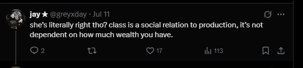
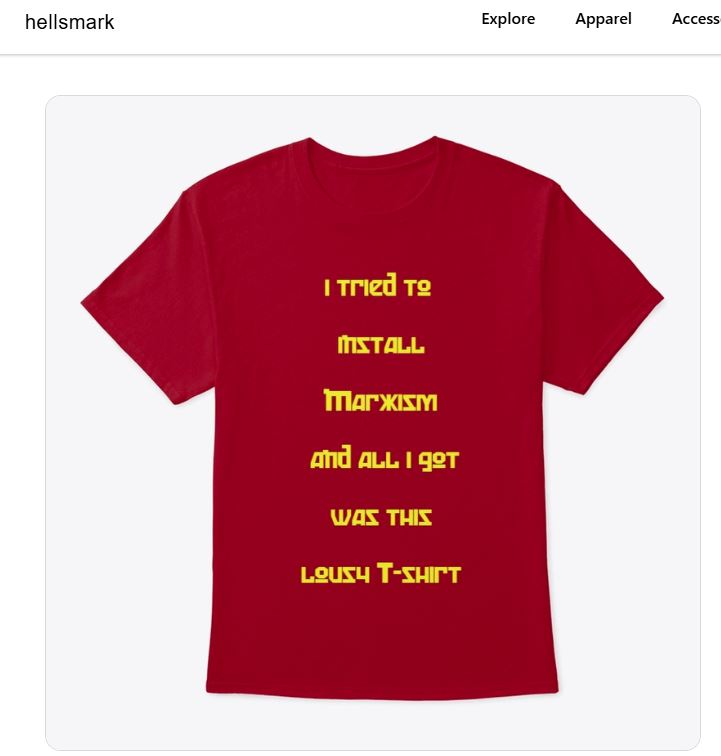

## Thesis to Challenge: 

Social class is fundamentally determined by one's relationship to the means of production, not by individual wealth.

    

   
 

## Premise to Challenge: 

Class isn't determined by wealth

    

  
 

## Counter-Argument: 

Neither system truly resolves poverty due to persistent personal gain motives at lower levels. 

 

## Refutation:

Even under Marxism, the poor must still rely on others to act in good faith. But the system leaves room for individuals to justify self-serving actions — allowing personal gain to be used as a rationalization for acting in bad faith.

 

## Rebuttal:

Smurfism aligns better with our democratic system than either Marxism or Capitalism.

 

## Link To Conclusions:

[Link to Conclusions](#Conclusions)

## Link To Merch Booth:

[Link to Merch Booth](#Merch-booth)

## Link To King Smurf:

[Link to King Smurf Episode](#King-Smurf)

 

---
PROMPTS
---

## 1st Prompt:  
---
### Is it Realistic to think Marxism could ever take over in America:

    Given the current United states trump republican administration, ICE, and a looming class war on
    the horizon, how likely would it be for Marxism to replace united states current system and gain 
    mainstream traction? Please use all updated resources and provide percentage values within 
    your conclusions.

>
> 🔮 Summary Outlook
>
> Scenario: Marxism replaces capitalism in U.S. within decade	
>
> Likelihood: Highly unlikely—estimate < 5% chance within the 
> next decade due to ideological, institutional, and 
> structural obstacles.
>

## 2nd Prompt: 
---
### Assume Marxism took over in the united states, do slumlords still exist

    Let's assume Marxism took over in the united states everywhere. In this example, do 
    slumlords still exist? Or has this new system removed the greed factor Capitalism 
    creates through self gain? Is there any chance for bad actors within the city housing 
    inspectors to make decisions solely for personal gain, say payments from a landlord to 
    look the other way? Does greed as a human emotion doesn't disappear because the 
    system changed?

>
> 🏘️ In a Marxist U.S., Do Slumlords Still Exist?
> 
> In theory:
>
> No. Marxism abolishes private property as it relates to capital
> and housing. Under Marxism:
>
> In practice, however:
>
> It depends on how faithfully and effectively Marxist 
> principles are implemented:
> 
> In past Marxist systems (e.g., USSR, Maoist China), some form of housing
> mismanagement and abuse still existed, just not by private landlords—but
> by state administrators, corrupt party members, or black-market operators.
>
> If the system is highly bureaucratic and opaque, corruption can still
> fester, even if it's not driven by private wealth accumulation.
>

## 3rd Prompt: 
---
### Under Marxism, Could the Contructive eviction loophole exist

    Please update your info from the data on: 
    
    https://github.com/Queen-Annes-Revenge-Mgmt/The-Eviction-Loophole

    Under this new Marxist America, could the situations outlined in this document 
    happen again to a family with little money? It sounds like under this system 
    housing inspection policies could be left to the interpretation of inspectors 
    that could be biased due to greed. is that true?

>
> 🏗️ Would This be Possible in a Marxist System?
>
> In principle:
>
> In a fully Marxist housing system, there would be no private 
> landlords, and housing would be state- or collectively-owned.
>
> Ideally, universal housing rights, with clear, equitable, 
> needs-based allocation and maintenance protocols.
>
> In practice:
> 
> Human behavior doesn't vanish. Corruption among officials—inspectors 
> or property managers—can still emerge.
> 
> If inspections rely on discretion rather than objective criteria,
> then bias and bribery can still infiltrate the system.
> 
> Marxist housing policy can eliminate profit-driven landlord abuse,
> but not necessarily human corruption. Inspector misconduct could 
> still occur through loopholes and biased enforcement—unless the 
> system includes checks, balance, and real accountability. An 
> ideology alone doesn’t prevent greed or abuse. It must be paired
> with ironclad institutional design.
>

## 4rd Prompt: 
---
### Under Maxism, how would a former "lower class" people make Change

Under Marxism, how would a former "lower class" renter make changes to a housing policy being abused by corrupt housing inspectors?

> 
>🧠 Bottom Line
> 
> 🟩 In ideal Marxism, a former lower-class renter becomes a 
> co-owner of housing decisions and can help rewrite policies
> through collective democratic structures.
>
> 🟥 In historical practice, centralized state control often 
> left little room for individual renters—especially poor ones—to
> challenge corruption without major risk.
>
>⚠️ So, under Marxism, whether abuse by corrupt housing inspectors 
> can be corrected depends not on ideology alone, but on how truly 
> democratic and accountable the system is in practice.
>

 

---
# RE-ROLL: ESTABLISH NEW CHAT TO CLEAR CONVERSATION 
---

## 1st Prompt:  
---
### WTF is "Smurfism"?

    Please describe to the form of democracy the Smurfs adhere to, in a short 
    but concise manner. Please provide an example.

>
> 🎯 Result:
>
> "Smurf democracy is a soft, consensus-driven system led by a wise elder,
> emphasizing cooperation, mutual aid, and social harmony over individual
> power or competition."
>

## 2nd Prompt: 
---
### Is it Realistic to think Smurfism could ever take over in America:

    Given the current United states trump republican administration, ICE, and 
    a looming class war on the horizon, how likely would it be for Smurfism to 
    replace united states current system and gain mainstream traction? If "Smurfism" 
    were real. Please use all updated resources and provide percentage values 
    within your conclusions.

>
> 🎯 Result:
>
> Replacing U.S. democracy with Smurf village-style communal 
> governance is nearly impossible (<1%).
>
> Local experimentation in intentional communities is slightly more 
> plausible (5–10%), especially as class war anxiety fuels 
> grassroots innovation
>

## 3rd Prompt: 
---
### Under Smurfism, Could the Contructive eviction loophole exist

    Please update your info from the data on: 
    
    https://github.com/Queen-Annes-Revenge-Mgmt/The-Eviction-Loophole

    Let's assume Smurfism broke out across America, could the situations outlined 
    in this document happen again to a family with little money in one of these 
    Smurf "villages"? It sounds like under this system housing inspection policies
    would not be left to the interpretation of inspectors that could be biased 
    due to greed.Is that true?

>
> 🏠 Summing it up
>
> If Smurfism’s ideals are preserved and enforced locally with community
> oversight, the abuse described in The Eviction Loophole would be largely
> prevented. But any system—even Smurfism—needs active participation,
> transparency, and accountability to keep it from turning into a new 
> version of what it replaced.
> 
> Unless Smurfism includes strong tenant protections—like legal aid, 
> caps on repair costs, or grace periods—the structural risks outlined 
> in "The Eviction Loophole" could absolutely happen again.
>

 

---
# Conclusions:
---

 

>
> We're fucked either way, as class and wealth remain linked. 
>
 

    Neither system offers a viable path forward, as the odds of successfully 
    implementing them are too low. Worse still, the underlying issues between 
    class and wealth remain—they're just redefined. Class becomes tied to 
    perceived wealth at any given moment, making it just as influential 
    and exclusionary as before.

    A few key truths:

    - No system guarantees success just by being implemented. Culture, 
    power, and enforcement shape the outcome.

    - Class and wealth remain linked, often through perception (status, 
    assets, influence), not just income.

    - Inequality can resurface even in systems designed to eliminate 
    it, if power structures adapt.

 

---
MERCH BOOTH
---

 

[Commu Smurf Shirt](https://hellsmark-2.creator-spring.com/listing/commu-smurf-shirt)

 

    

 

[\"I tried to install Marxism and all I got was this lousy T-shirt\" Shirt](https://hellsmark-2.creator-spring.com/listing/lousy-marxism-t-shirt)

 

    

 

---
KING SMURF EPISODE
---

**Link**: [King Smurf Youtube Episode](https://youtu.be/-ngI49yh_ow?si=20uTjJrzuWOvUdxD)

  

